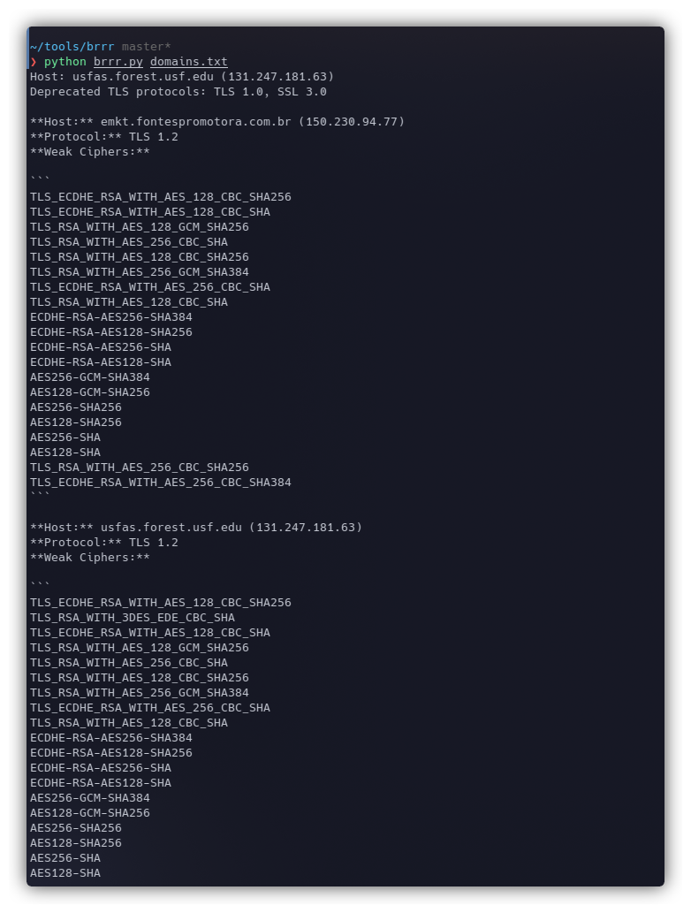

# Brrr3.0

Brrr3.0 is a parser on top of Project Discovery's TLSX tool. This takes a list of hosts as input and returns a markdown output in the CLI. <br>
The output contains a list of Deprecated Protocols and Weak Cipher Suites for the domains provided. 

## Requirements

- Python 3.x
- tlsx 

## Installation

1. Clone the repository:

   ```bash
   git clone https://github.com/your-username/tls-analysis.git
   ```

2. Run Brrr and provide the domain.txt file
   
   ```bash
   python brrr.py domain_file.txt
   ```

3. Wait for it to run and view the output on the CLI.

